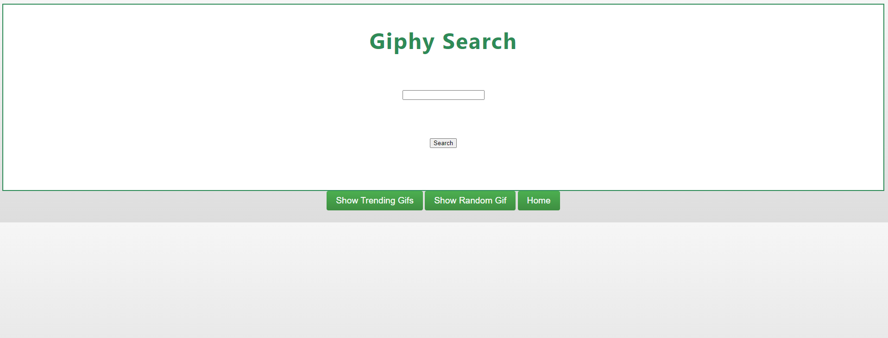

# GiphySearchEngine

Fetch GIFS of your choice from GIPHY library

## Getting started

- run `composer install`
- rename `.env.example` to `.env`
- get your API key from https://developers.giphy.com/ and paste it in `.env`
- run `php -S localhost:8000` from project root to start server

